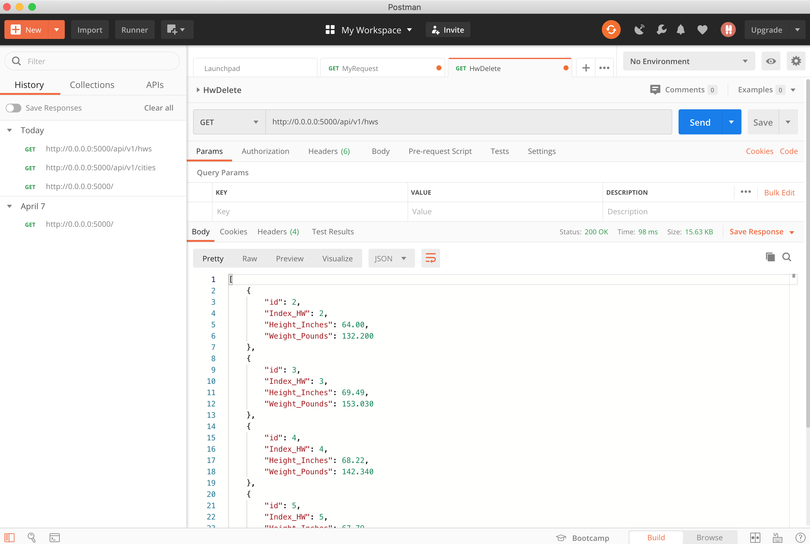
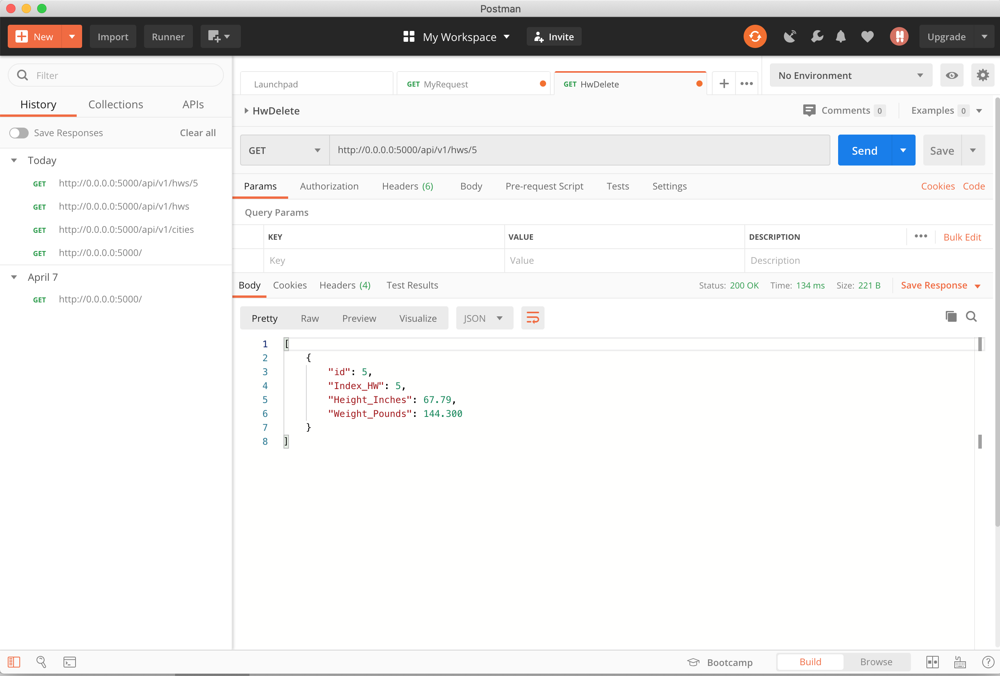
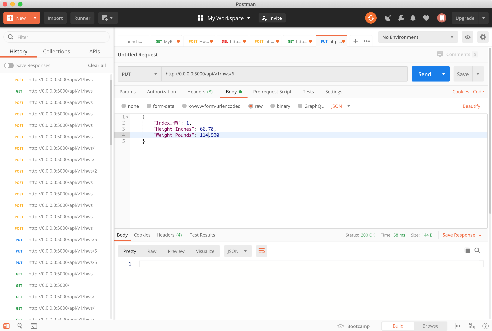
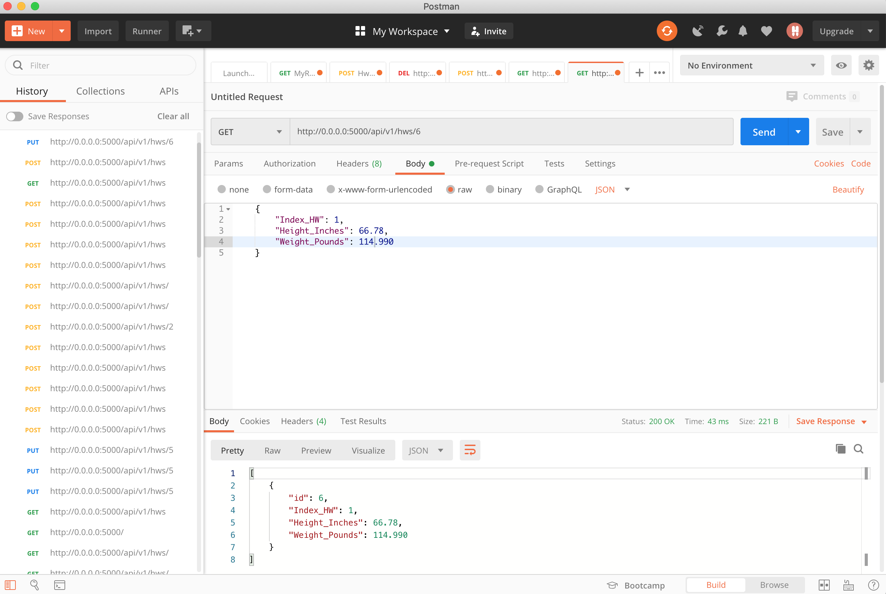
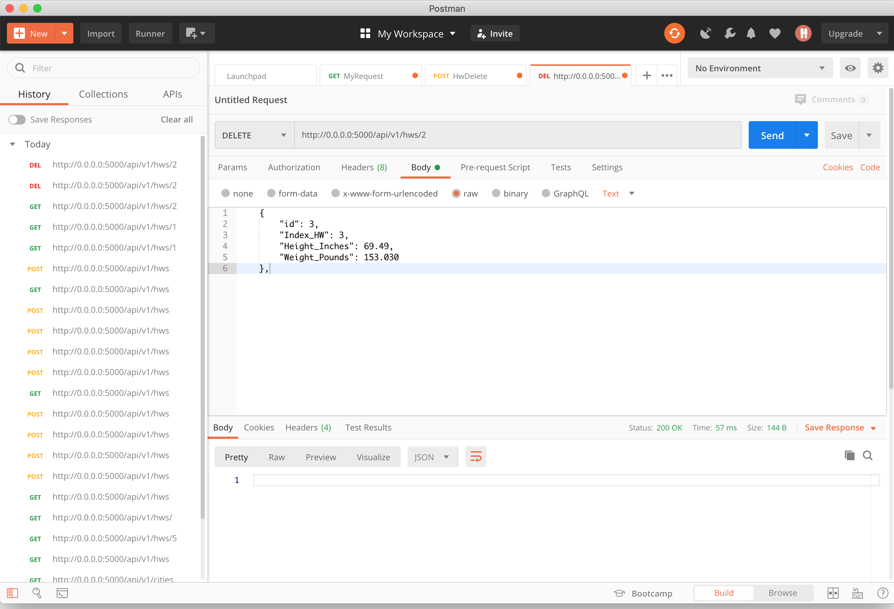

# Final Project Part 2 - APIs
Part 2 of the final project turn in assignment. 

## Word doc with screenshots
[Final Project Part2.docx](/Final Project Part 2.docx)

## Screenshots 

A: Project showing postman listing all records

B. Project showing postman showing one record with a get request

c.	Project showing postman creating a record by showing the post request and the result in the record listing

d.	Project showing postman edit a record by showing the put request and the results in the record listing

e.	Project showing postman delete a record by showing the delete request and the results in the record listing

