# Final Project Part 1
Part 1 of the final project turn in assignment. 

## Screenshots 

A: Databases running in Pycharm
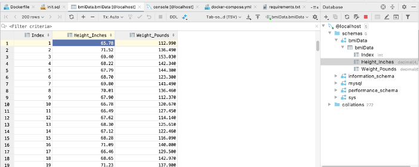

B: Project running in browser homepage
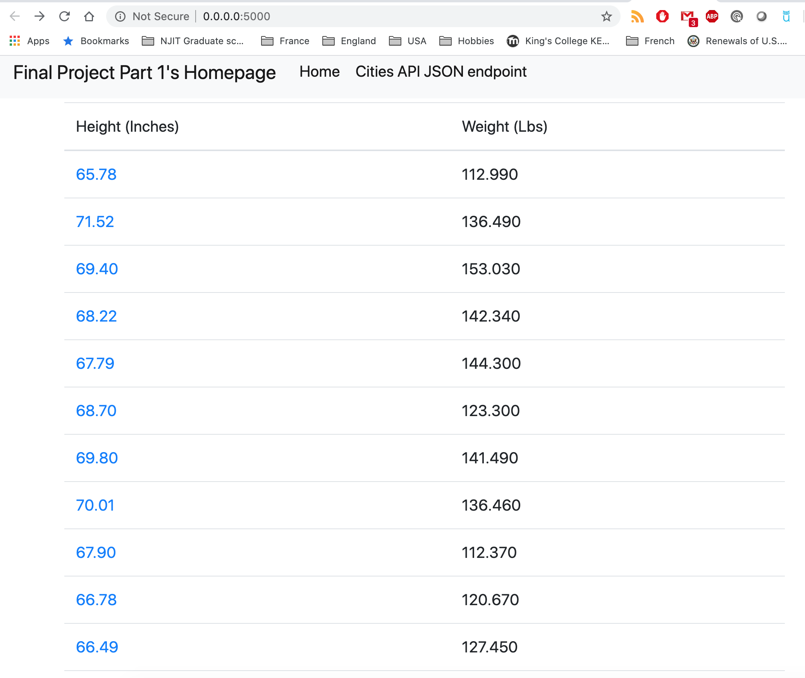

C. Project running showing an individual data record
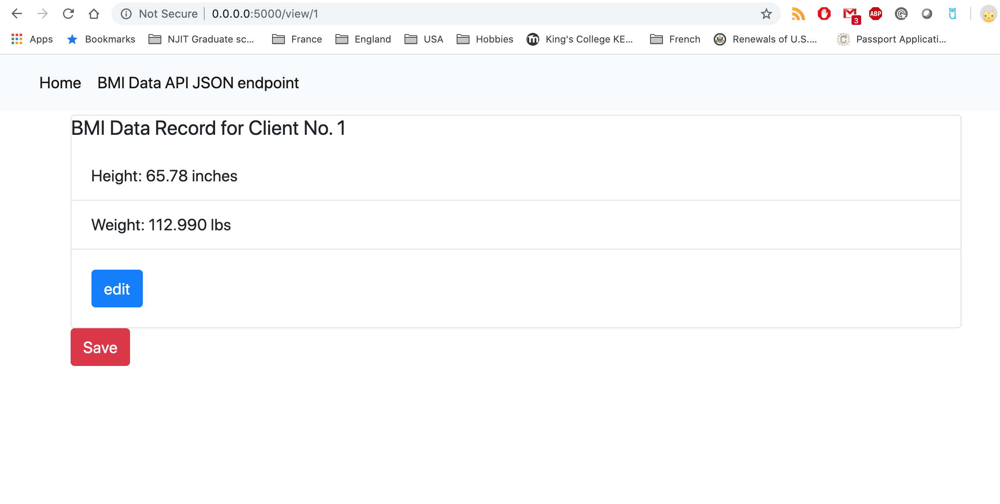

d.	Project showing a new data record being successfully added
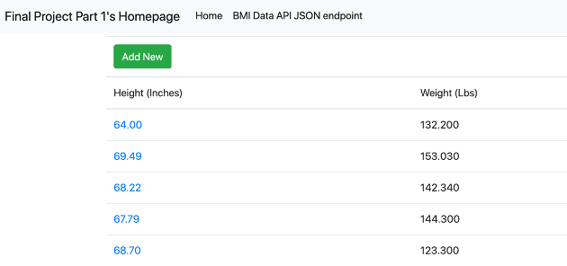

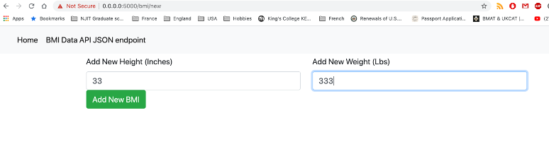

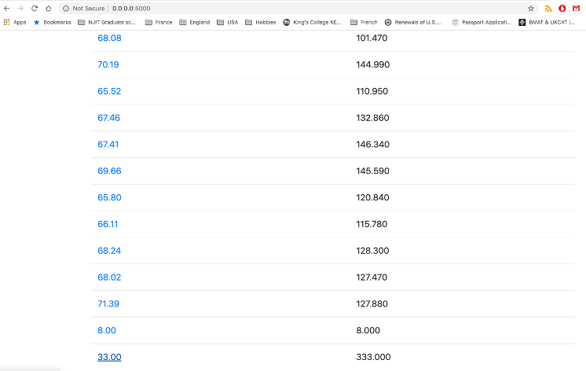

e.	Project showing a record being successfully updated
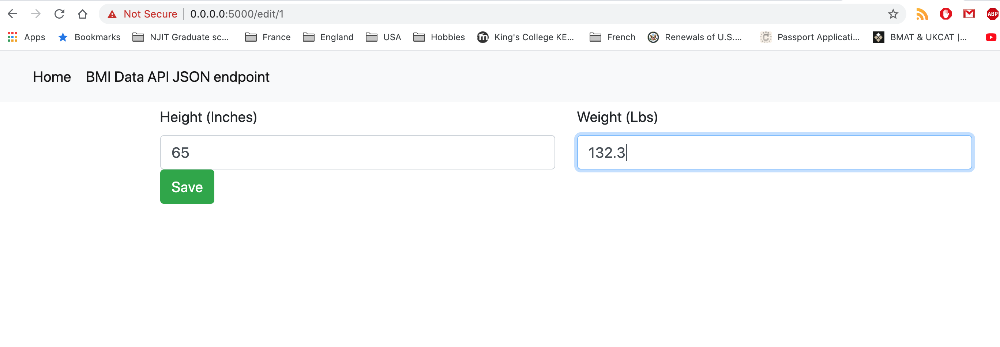

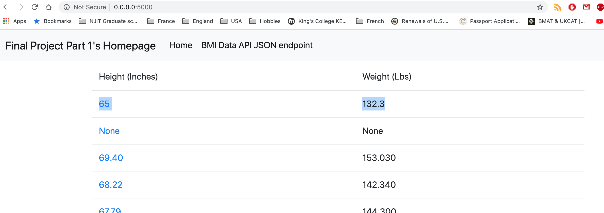

f.	Project showing a record being deleted
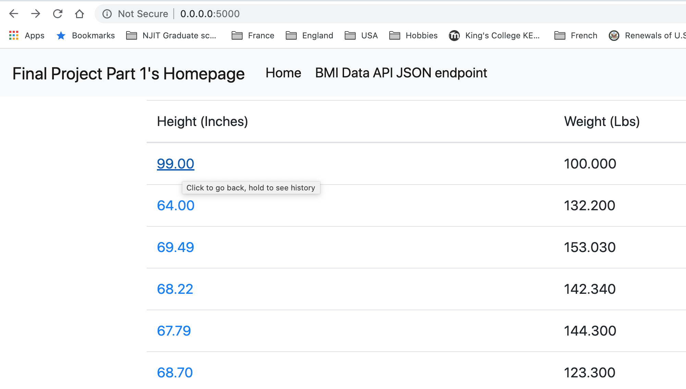

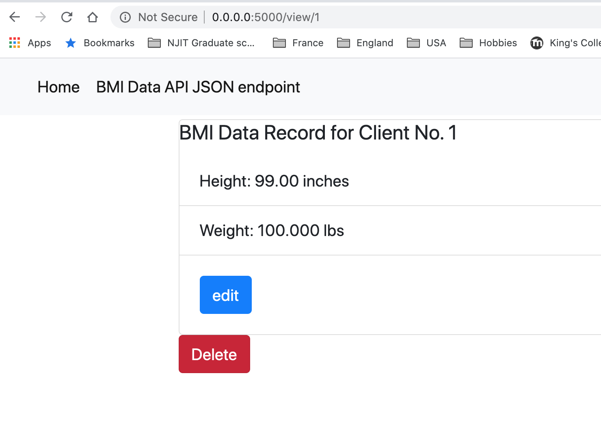

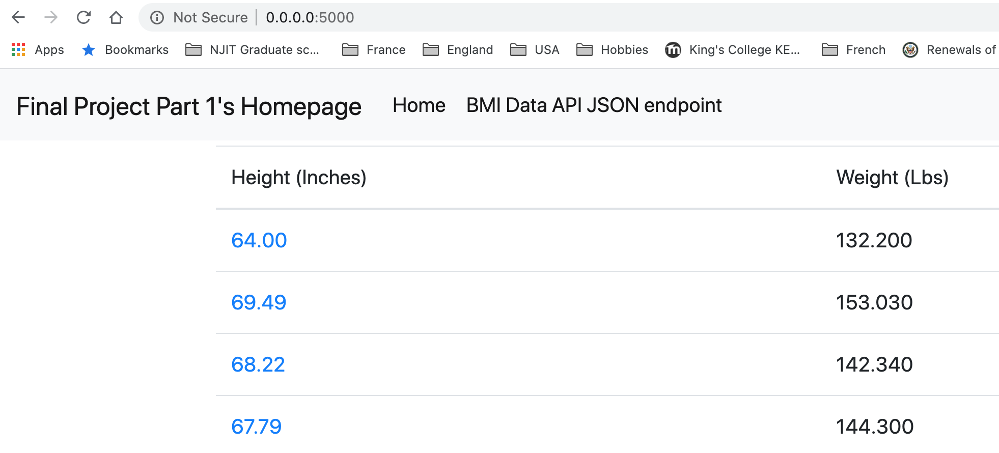
